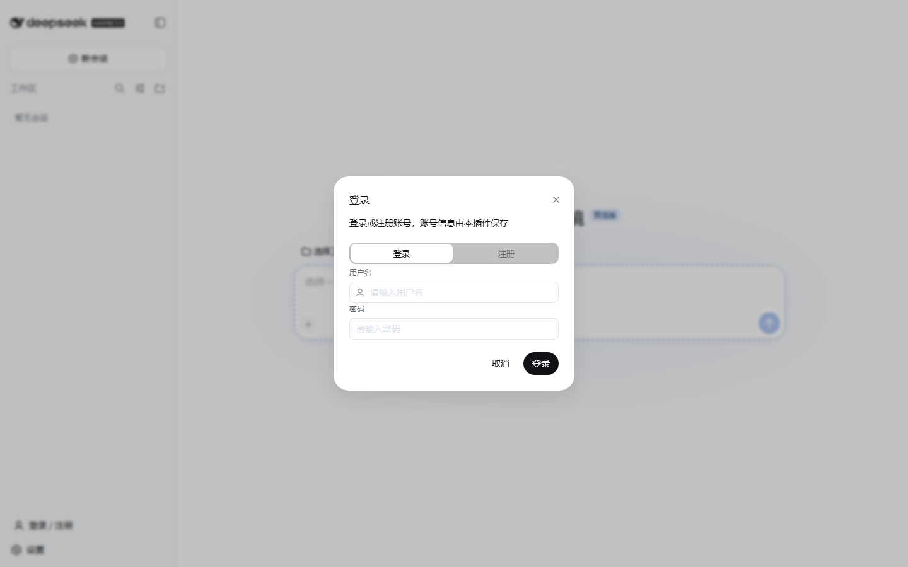
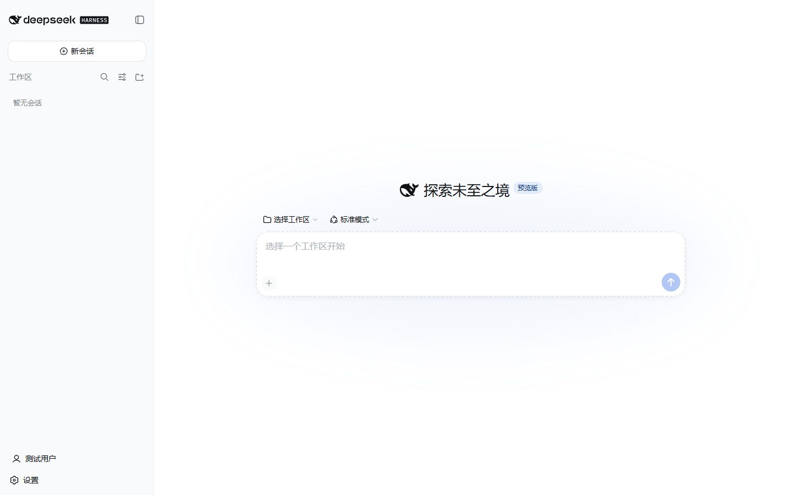

# dsh-auth

> DeepSeek Harness Web UI 的**登录 / 注册窗口**插件：侧边栏入口按钮 + 登录 / 注册弹窗，
> 自带演示鉴权 API 与内置管理员账号，开箱即用；也可一键切换代理模式对接你自己的账号系统。




## 特性

- 侧边栏底部「登录 / 注册」入口，折叠态自动变为圆形图标，附 Tooltip。
- 登录 / 注册双 Tab 弹窗：表单校验、忙碌状态、错误与成功提示，支持回车提交；
  管理员关闭注册后，注册 Tab 自动禁用并提示。
- 登录成功后侧边栏显示用户名，弹窗切换为「我的账号」资料视图，可一键退出登录。
- 会话令牌保存在浏览器 localStorage，刷新页面自动恢复登录状态。
- **内置管理员账号**（演示模式）：`admin / admin123`，可随时开放/关闭注册。
- **设置面板账号管理**：列出所有账号、删除普通账号、一键开关注册。
- **演示模式（默认）**：宿主端自带账号存储（scrypt 加盐哈希 + 随机令牌），数据持久化到
  profile 的 `data/dsh-auth/auth.json`，零外部依赖。
- **代理模式**：把全部 `/dsh-auth/*` 请求转发到你的鉴权后端，无 CORS 问题。
- 完全遵循官方插件通道：`dsh.bundle` 安装层 + `dsh.client` 客户端模块 +
  slot 系统（`sidebar.footer.action` 入口、`shell.overlay` 弹窗、
  `settings.general.item` 设置行）。

## 界面预览

| 登录 / 注册窗口 | 登录后状态 |
|---|---|
|  |  |

## 快速开始

需要 Node.js ≥ 22.19 和 [`@deepseek-ai/dsh`](https://www.npmjs.com/package/@deepseek-ai/dsh)
CLI（或 [DeepSeek Harness](https://github.com/deepseek-ai/deepseek-harness) 源码 checkout）。

### 从本地目录安装

```sh
cd dsh-auth
npm install          # 或 pnpm install（仅构建期需要 tsdown/typescript）
npm run build        # 生成 lib/index.js + lib/client.js
cd ..
dsh plugin --profile web add ./dsh-auth
dsh --profile web web
```

打开 `http://127.0.0.1:3080`，侧边栏底部即可看到「登录 / 注册」入口。

> 也可以直接安装构建产物：`dsh plugin --profile web add ./dsh-auth-0.1.0.tgz`
> （先执行 `npm pack`）。发布到 npm 后则为 `dsh plugin --profile web add dsh-auth`。

### 默认账号（演示模式）

| 角色 | 用户名 | 密码 |
|---|---|---|
| 管理员 | `admin` | `admin123` |

登录管理员账号后，打开 **设置 → 账号管理** 即可管理账号：开关注册、查看账号列表、
删除普通账号。内置管理员账号不可删除。

### 从源码 checkout 安装（开发模式）

```sh
git clone https://github.com/deepseek-ai/deepseek-harness.git
cd deepseek-harness && pnpm install && pnpm run build
pnpm dsh plugin --profile web add /absolute/path/to/dsh-auth
pnpm dsh --profile web web
```

修改客户端代码后需重新构建 bundle（`npm run build`）再刷新页面；开发时也可以让
`dsh web` 以源码模式运行，并另开 `pnpm run dev:web` 监听 client bundle 热更新。

## 配置

配置写在 profile 的 `cordis.patch.yml` 或 bundle 行中。默认即演示模式，无需任何配置：

```yaml
- insert:
    - id: auth-window
      name: dsh-auth
      config:
        mode: demo          # demo | proxy
        apiBaseUrl: ''      # proxy 模式必填，转发目标
        dataDir: ''         # 演示模式数据目录；留空 = <profile>/data/dsh-auth
        sessionTtlHours: 168
```

## 架构

插件由两个半区组成，全部通过官方插件通道挂载：

| 半区 | 入口 | 作用 |
|---|---|---|
| Host（Node） | [`src/index.ts`](src/index.ts) | 在 `ctx.webServer` 注册 `/dsh-auth/*` 路由（同源、无 CORS）；演示模式实现账号/会话/注册开关存储，代理模式转发外部 API |
| Client（浏览器） | [`src/client/index.ts`](src/client/index.ts) | 通过 `dsh.client` 客户端模块机制加载；`sidebar.footer.action` 挂入口按钮，`shell.overlay` 挂登录窗口，`settings.general.item` 挂账号管理行，三处共享同一个 store 实例 |

`shell.overlay` 是官方文档中专门留给插件的「全屏悬浮层」插槽（additive list slot），
登录窗口以框架自带的 `Modal` 组件渲染在其上。

## /dsh-auth API（演示模式）

| 方法 | 路径 | 请求体 | 返回 |
|---|---|---|---|
| POST | `/dsh-auth/register` | `{ username, password, displayName? }` | `201 { ok, user }`；409 用户名已存在；403 注册已关闭 |
| POST | `/dsh-auth/login` | `{ username, password }` | `200 { ok, token, user }`；401 凭据错误 |
| GET | `/dsh-auth/session` | 请求头 `Authorization: Bearer <token>` | `200 { ok, user }`；401 未登录/过期 |
| POST | `/dsh-auth/logout` | 请求头同上 | `200 { ok }` |
| GET | `/dsh-auth/meta` | - | `200 { ok, mode, registrationOpen }` |
| GET | `/dsh-auth/admin/users` | 请求头（管理员） | `200 { ok, users, registrationOpen }`；403 非管理员 |
| POST | `/dsh-auth/admin/registration` | `{ open: boolean }`（管理员） | `200 { ok, registrationOpen }` |
| POST | `/dsh-auth/admin/users/remove` | `{ username }`（管理员） | `200 { ok, removed }`；内置管理员不可删 |

失败统一返回 `{ ok: false, error: { code, message } }`。

## 安全说明

- 演示模式仅适合本地/内网使用：明文 JSON 存储、无登录限流、单进程。
- 密码以 scrypt（随机盐）哈希保存；令牌只存 SHA-256 摘要，不落明文。
- 默认管理员密码仅用于本地演示，正式部署前请修改或改用代理模式。
- 生产使用请配置 `mode: proxy` 接入真实鉴权服务，或基于本仓库二次开发。

## 开发与测试

```sh
npm run build       # tsdown 构建宿主 + 客户端 bundle（无需 dsh checkout）
npm run typecheck   # 需要 dsh 源码 checkout（tsconfig paths 指向其 lib/types）
npm pack            # 生成可安装的 tarball
```

仓库附带 Playwright 端到端脚本，覆盖完整用户旅程（打开弹窗、注册、登录、刷新恢复会话、
查看资料、退出登录、错误密码提示、管理员账号管理、注册开关），并在每个步骤截图：

```sh
# 先启动 dsh web（默认 3080 端口），然后：
node scripts/e2e-test.mjs http://127.0.0.1:3080 ./test-shots
```

## 路线图

- 密码找回 / 邮箱验证流程
- 登录限流与失败锁定
- 将演示存储迁移到官方 `ctx.storageDomain` 持久化
- 发布到 npm 与 [dsh-plugin](https://github.com/topics/dsh-plugin) 主题

## License

[MIT](LICENSE)
